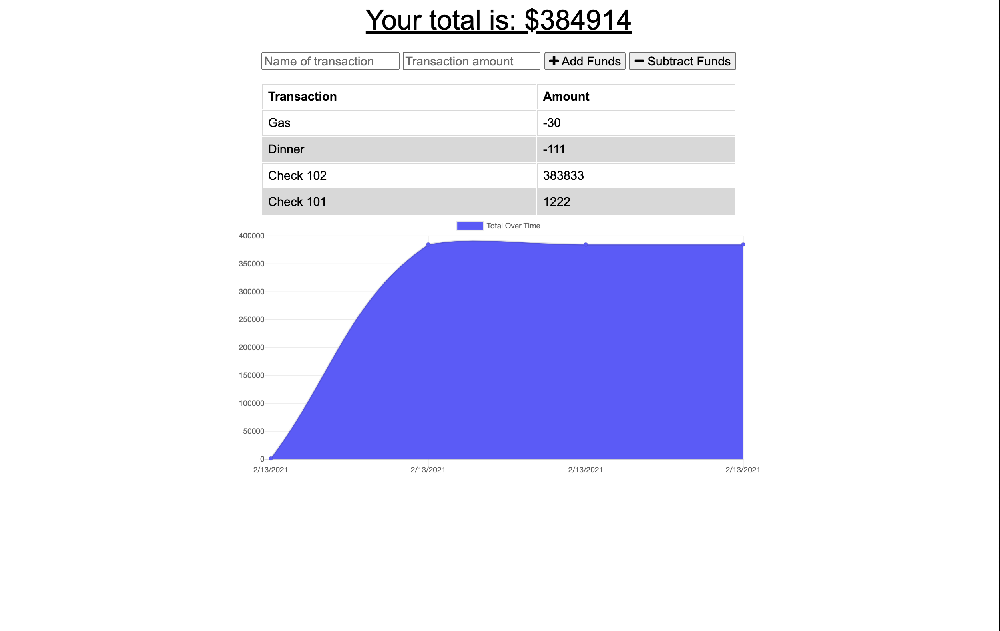

# Budget Tracker

## Description

The user will be able to add expenses and deposits to their budget with or without a connection. When entering transactions offline, they should populate the total when brought back online.

Offline Functionality:

  * Enter deposits offline

  * Enter expenses offline

When brought back online:

  * Offline entries should be added to tracker.

Giving users a fast and easy way to track their money is important, but allowing them to access that information anytime is even more important. Having offline functionality is paramount to our applications success.

## Deployed Application

* [Github Repository](https://github.com/milehighcoder/budget-tracker)
* [Budget Tracker](https://milehighcoder-budget-tracker.herokuapp.com/)

## Table of Contents

* [Usage](#usage)
* [Contributing](#contributing)
* [License](#license)
* [Questions](#questions)

## Usage

AS AN avid traveller I WANT to be able to track my withdrawals and deposits with or without a data/internet connection SO THAT my account balance is accurate when I am traveling.

## Contributing

Please ensure that your pull request adheres to the following guidelines:

* Alphabetize your entry.
* Search previous suggestions before making a new one, as yours may be a duplicate.
* Suggested README's should be beautiful and/or stand out in some way.
* Make an individual pull request for each suggestion.
* New categories, or improvements to the existing categorization are welcome.
* Keep descriptions short and simple, but descriptive.
* Start the description with a capital and end with a full stop/period.
* Check your spelling and grammar.
* Make sure your text editor is set to remove trailing whitespace.
* Use the `#readme` anchor for GitHub READMEs to link them directly

Thank you for your suggestions!

## License

This project is MIT licensed.

## Questions

For more information about this application, please contact me via Github.

* [Mychal Martinez](https://github.com/milehighcoder)
